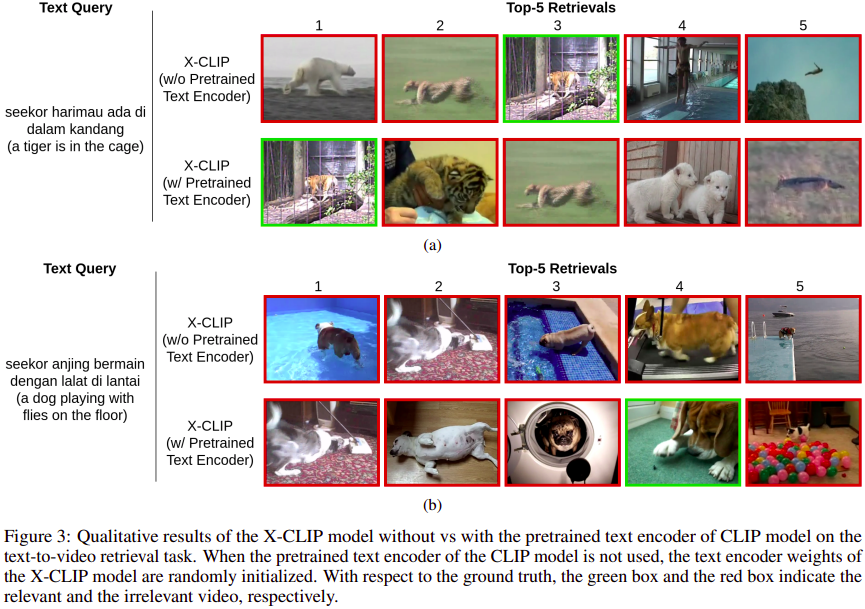
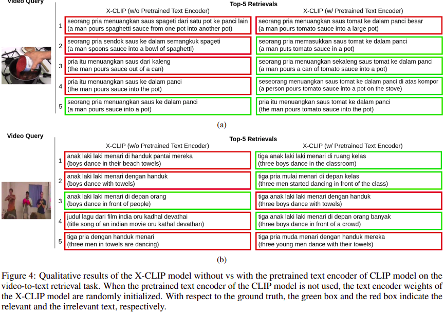
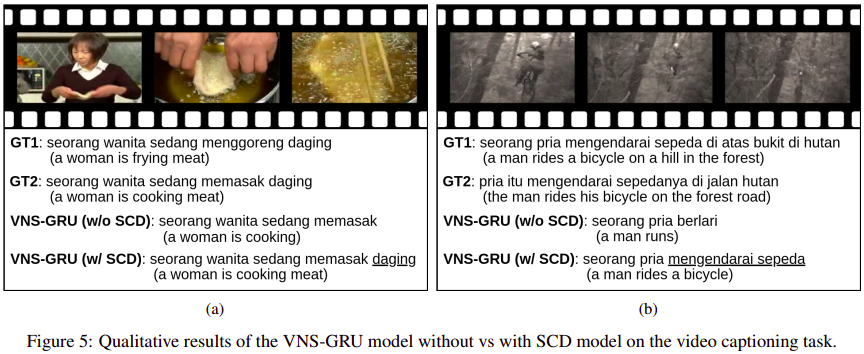

# MSVD-Indonesian
[](https://paperswithcode.com/sota/video-retrieval-on-msvd-indonesian?p=msvd-indonesian-a-benchmark-for-multimodal) [](https://paperswithcode.com/sota/text-to-video-retrieval-on-msvd-indonesian?p=msvd-indonesian-a-benchmark-for-multimodal) [](https://paperswithcode.com/sota/video-to-text-retrieval-on-msvd-indonesian?p=msvd-indonesian-a-benchmark-for-multimodal) [](https://paperswithcode.com/sota/video-captioning-on-msvd-indonesian?p=msvd-indonesian-a-benchmark-for-multimodal)


MSVD-Indonesian (Paper: [link](https://arxiv.org/abs/2306.11341)) is derived from the MSVD dataset, which is obtained with the help of a machine translation service. This dataset can be used for multimodal video-text tasks, including text-to-video retrieval, video-to-text retrieval, and video captioning. Same as the original English dataset, the MSVD-Indonesian dataset contains about 80k video-text pairs.

## Data

Indonesian sentences: [link](https://github.com/willyfh/msvd-indonesian/blob/main/data/MSVD-indonesian.txt)

Raw videos: [link](https://www.cs.utexas.edu/users/ml/clamp/videoDescription/YouTubeClips.tar)

## Qualitative Results

### Text-to-Video  Retrieval


### Video-to-Text Retrieval


### Video Captioning


## Citation
If you find our work useful in your research, please cite:

```bibtex
@article{Hendria2023MSVDID,
  title={{MSVD}-{I}ndonesian: A Benchmark for Multimodal Video-Text Tasks in Indonesian},
  author={Willy Fitra Hendria},
  journal={arXiv preprint arXiv:2306.11341},
  year={2023}
}
```

## Acknowledgments
Our experimental results are obtained utilizing the resources from [X-CLIP](https://github.com/xuguohai/X-CLIP) and [VNS-GRU](https://github.com/WingsBrokenAngel/delving-deeper-into-the-decoder-for-video-captioning). We thank the original authors for their open-sourcing.
